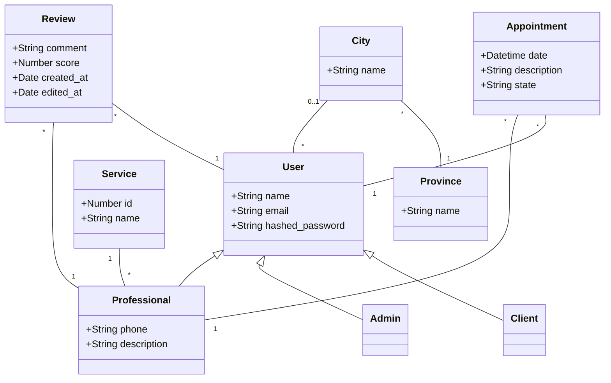

# ServiYa - Los servicios que necesitás, a tu alcance!

## Introduccion
En este repositorio se encuentra todo el contenido relacionado al trabajo práctico de nuestro grupo 
para la materia "Técnicas y Tecnologías Avanzadas de Desarrollo de Software" de la UTN FRRo(Universidad Tecnológica Nacional Facultad Regional Rosario).

### Integrantes del grupo
* 47799 - Cappellini, Lucía
* 47773 - Mollo, Bruno
* 47772 - Di Giacinti, Ramiro
* 46095 - Braida, Facundo 

## Tema
### Descripción
El producto a desarrollarse será una plataforma de contratación de servicios a domicilio que permitirá poner en contacto a 
distintos profesionales de distintos rubros con potenciales clientes que requieran de sus servicios.

### Modelo de datos

## Alcance Funcional 

### Alcance Mínimo

#### Regularidad:
<table>
    <tr>
        <th>Req</th>
        <th>Detalle</th>
    </tr>    
    <tr>
        <td>CRUD simple</td>
        <td>
            <ol>
                <li>CRUD Usuario</li>
                <li>CRUD Servicio</li>
                <li>CRUD Provincia</li>
                <li>CRUD Ciudad</li>
            </ol>
        </td>
    </tr>
    <tr>
        <td>CRUD dependiente</td>
        <td>
            <ol>
                <li>CRUD Review</li>
                <li>CRUD Turno</li>
            </ol>
        </td>
    </tr>
    <tr>
        <td>Listado y detalle</td>
        <td>
            <ol>
                <li>
                    Listado de Profesionales (filtrado por servicio y ciudad): muestra nombre, servicio,             
                    puntaje y un botón que muestra perfil del profesional con Reviews
                </li>
                <li>
                    Listado de Turnos de un Profesional: muestra fecha, lugar, estado y descripción y un botón "Detalles" para aceptar o rechazar un turno 
                </li>
            </ol>
        </td>
    </tr>
    <tr>
        <td>CUU/Epic</td>
        <td>
            <ol>
                <li>Agendar turno con Profesional</li>
                <li>Realizar Review de Profesional</li>
                <li>Aceptar/rechazar turno</li>
            </ol>
        </td>
    </tr>
</table>

#### Adicionales para Aprobación (WIP):
<table>
    <tr>
        <th>Req</th>
        <th>Detalle</th>
    </tr>
    <tr>
        <td>CRUD</td>
        <td>
            <ol>
                <li>CRUD Usuario Cliente</li>
                <li>CRUD Servicio</li>
                <li>CRUD Usuario Profesional</li>
                <li>CRUD Especialización</li>
                <li>CRUD Turno</li>
                <li>-</li>
                <li>-</li>
            </ol>
        </td>
    </tr>
    <tr>
        <td>CUU/Epic</td>
        <td>
            <ol>
                <li>Agendar turno con Profesional</li>
                <li>Realizar review de Profesional</li>
                <li>Cancelar turno con Profesional</li><li>-</li>
            </ol>
        </td>
    </tr>
</table>

### Alcance Adicional Voluntario (WIP)

*Nota*: El Alcance Adicional Voluntario es opcional, pero ayuda a que la funcionalidad del sistema esté completa y será considerado en la nota en función de su complejidad y esfuerzo.

<table>
    <tr>
        <th>Req</th>
        <th>Detalle</th>
    </tr>
    <tr>
        <td>Listados</td>
        <td>
            <ol>
                <li>-</li>
                <li>-</li>
            </ol>
        </td>
    </tr>
    <tr>
        <td>CUU/Epic</td>
        <td>
            <ol>
                <li>-</li>
            </ol>
        </td>
    </tr>
    <tr>
        <td>Otros</td>
        <td>
            <ol>
                <li>-</li>
            </ol>
        </td>
    </tr>
</table>

De ejemplo, borrar despues:
|Req|Detalle|
|:-|:-|
|Listados |1. Estadía del día filtrado por fecha muestra, cliente, habitaciones y estado  2. Reservas filtradas por cliente muestra datos del cliente y de cada reserve fechas, estado cantidad de habitaciones y huespedes|
|CUU/Epic|1. Consumir servicios 2. Cancelación de reserva|
|Otros|1. Envío de recordatorio de reserva por email|
