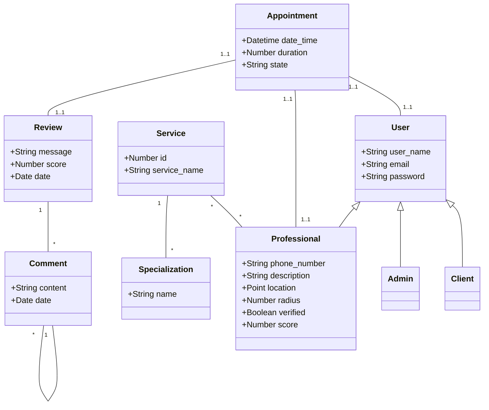

# Propuesta TP DSW

## Grupo
### Integrantes
* 47799 - Cappellini, Lucía
* 47773 - Mollo, Bruno
* 47772 - Di Giacinti, Ramiro
* 46095 - Braida, Facundo 

## Tema
### Descripción
Se desarrollará una plataforma que pondrá en contacto personas que brindan distintos servicios con sus potenciales clientes.

### Modelo de datos

## Alcance Funcional 

### Alcance Mínimo

#### Regularidad:
<table>
    <tr>
        <th>Req</th>
        <th>Detalle</th>
    </tr>    
    <tr>
        <td>CRUD simple</td>
        <td>
            <ol>
                <li>CRUD Usuario Cliente</li>
                <li>CRUD Servicio</li>
                <li>CRUD Usuario Profesional*</li>
            </ol>
        </td>
    </tr>
    <tr>
        <td>CRUD dependiente</td>
        <td>
            <ol>
                <li>CRUD Especializacion {depende de} Servicio</li>
                <li>CRUD Turno {depende de} Profesional y Cliente</li>
            </ol>
        </td>
    </tr>
    <tr>
        <td>Listado y detalle</td>
        <td>
            <ol>
                <li>
                    Listado de Profesionales filtrado por servicio/especialidad/nombre, muestra nombre, servicio,             
                    especialidades, puntaje => detalle muestra perfil de Profesional con Reviews   
                </li>
                <li>
                    Listado de Turnos pendientes de un Profesional, muestra  fecha, lugar y descripcion => detalle     muestra 
                    fecha, lugar, descripcion y Cliente; ademas de opcion de cancelar 
                </li>
            </ol>
        </td>
    </tr>
    <tr>
        <td>CUU/Epic</td>
        <td>
            <ol>
                <li>Agendar turno con Profesional</li>
                <li>Realizar Review de Profesional</li>
            </ol>
        </td>
    </tr>
</table>

*Nota*: Profesional depende de Servicio, pero no nos importa

#### Adicionales para Aprobación:
<table>
    <tr>
        <th>Req</th>
        <th>Detalle</th>
    </tr>
    <tr>
        <td>CRUD</td>
        <td>
            <ol>
                <li>CRUD Usuario Cliente</li>
                <li>CRUD Servicio</li>
                <li>CRUD Usuario Profesional</li>
                <li>CRUD Especializacion</li>
                <li>CRUD Turno</li>
                <li>-</li>
                <li>-</li>
            </ol>
        </td>
    </tr>
    <tr>
        <td>CUU/Epic</td>
        <td>
            <ol>
                <li>Agendar turno con Profesional</li>
                <li>Realizar Review de Profesional</li>
                <li>Cancelar Truno con Profesional</li><li>-</li>
            </ol>
        </td>
    </tr>
</table>

### Alcance Adicional Voluntario

*Nota*: El Alcance Adicional Voluntario es opcional, pero ayuda a que la funcionalidad del sistema esté completa y será considerado en la nota en función de su complejidad y esfuerzo.

<table>
    <tr>
        <th>Req</th>
        <th>Detalle</th>
    </tr>
    <tr>
        <td>Listados</td>
        <td>
            <ol>
                <li>-</li>
                <li>-</li>
            </ol>
        </td>
    </tr>
    <tr>
        <td>CUU/Epic</td>
        <td>
            <ol>
                <li>-</li>
            </ol>
        </td>
    </tr>
    <tr>
        <td>Otros</td>
        <td>
            <ol>
                <li>-</li>
            </ol>
        </td>
    </tr>
</table>

De ejemplo, borrar despues:
|Req|Detalle|
|:-|:-|
|Listados |1. Estadía del día filtrado por fecha muestra, cliente, habitaciones y estado  2. Reservas filtradas por cliente muestra datos del cliente y de cada reserve fechas, estado cantidad de habitaciones y huespedes|
|CUU/Epic|1. Consumir servicios 2. Cancelación de reserva|
|Otros|1. Envío de recordatorio de reserva por email|
